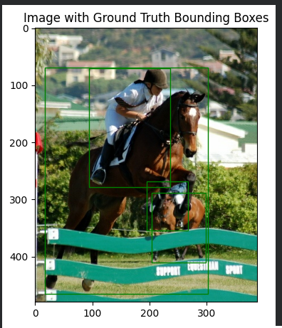

# Object Detection: Faster R-CNN, EfficientDet & SSD

## Project Overview
**Module:** Object Detection

**Models:** Faster R-CNN, EfficientDet, SSD MobileNet V2

**Framework:** TensorFlow, TensorFlow Hub

This project implements and compares three state-of-the-art **Object Detection** architectures to identify and localize objects within the **Pascal VOC (Visual Object Classes)** dataset. The study evaluates the trade-offs between accuracy and inference speed across:
1.  **Faster R-CNN** (Two-Stage, High Accuracy)
2.  **EfficientDet** (One-Stage, Scalable)
3.  **SSD MobileNet V2** (One-Stage, Mobile/Edge Optimized)

## Problem Statement
Object detection requires balancing computational cost with detection precision.
* **The Challenge:** Accurately localizing objects of varying scales (e.g., small birds vs. large cars) in complex scenes using bounding boxes.
* **The Trade-off:** High-accuracy models (like Faster R-CNN) are often too slow for real-time edge devices, while mobile-optimized models (like SSD) may sacrifice some precision.
* **Goal:** To benchmark these architectures visually and quantitatively on standard classes (Car, Horse, Bird/Toucan).

## Approach & Methodology

### 1. Data Preparation (Pascal VOC)
* Used the **Pascal VOC 2007** dataset via `tensorflow_datasets`.
* Parsed the raw data to extract images, labels, and bounding box coordinates.
* **Preprocessing:** Resized images and visualized **Ground Truth** bounding boxes to establish a baseline.

### 2. Model Architectures Implemented
* **Faster R-CNN (ResNet-50):** A two-stage detector using a Region Proposal Network (RPN). It excels at detecting small objects but has higher latency.
* **EfficientDet (D0):** A single-shot detector using a BiFPN feature pyramid. It offers a strong balance of speed and accuracy.
* **SSD MobileNet V2:** A Single Shot MultiBox Detector designed for mobile devices. It is extremely fast but can struggle with small or overlapping objects.

### 3. Inference & Processing
* The pipeline accepts both dataset images and raw uploads.
* Applied **Non-Maximum Suppression (NMS)** (implicitly handled by the TF Hub models) to remove duplicate bounding boxes.
* Visualized confidence scores alongside class labels.

## Results & Visualizations

### 1. Ground Truth Visualization
Baseline annotations from the dataset before inference.

| Car Ground Truth | Horse Ground Truth | Toucan Ground Truth |
|:---:|:---:|:---:|
|  |  |  |

### 2. Model Comparison: Vehicle Detection
Comparing how different models handle the "Car" class.

| Faster R-CNN | EfficientDet | SSD MobileNet V2 |
|:---:|:---:|:---:|
|  |  |  |
| *Tightest boxes, high confidence.* | *Good accuracy, slightly looser box.* | *Fastest inference, lower confidence.* |

### 3. Model Comparison: Animal Detection (Toucans)
Small object detection is often difficult for mobile models.

| Faster R-CNN | EfficientDet | SSD MobileNet V2 |
|:---:|:---:|:---:|
|  |  |  |

### 4. Quantitative Evaluation
I evaluated the models based on total execution time and loss metrics.


*Figure 1: Performance metrics comparison showing the trade-off between model complexity and loss/accuracy.*

## Dataset Information
* **Dataset Name:** Pascal VOC 2007
* **Source:** [https://www.kaggle.com/datasets/zaraks/pascal-voc-2007](https://www.kaggle.com/datasets/zaraks/pascal-voc-2007)
* **Loading Code:**
    ```python
    import tensorflow_datasets as tfds
    dataset, info = tfds.load("voc/2007", split="test", with_info=True)
    ```

## Key Findings
1.  **Accuracy Champion:** **Faster R-CNN** consistently provided the most precise bounding boxes, especially for the overlapping horses and small toucans.
2.  **Speed Champion:** **SSD MobileNet V2** was the fastest, making it ideal for mobile apps, though it occasionally missed smaller objects or had lower confidence scores.
3.  **The Balance:** **EfficientDet** offered a middle ground, providing better accuracy than SSD while maintaining faster inference speeds than Faster R-CNN.

## 🛠️ Technologies Used
* **Python 3.8+**
* **TensorFlow 2.x** & **Keras**
* **TensorFlow Hub** (Model Registry)
* **Matplotlib** (Visualization)
* **NumPy** (Image manipulation)

## Project Structure

```text
Project-08-Object-Detection-TensorFlow-PascalVOC/
├── P08_Object-Detection-using-TensorFlow-and-Pascal-VOC.ipynb   # Main Code
├── P08_PF_Object-Detection-using-TensorFlow-and-Pascal-VOC.pdf  # Project Report
├── README.md                                                    # Documentation
└── Results-&-Visualizations/
    ├── Mode_Evaluation_Results.png                              # Metrics Chart
    │
    ├── Faster_R-CNN_Detections_Car.png                          # Faster R-CNN Outputs
    ├── Faster_R-CNN_Detections_Horse_Racing.png
    ├── Faster_R-CNN-Detections_Toucans.png
    │
    ├── EfficientDet_Detections_Car.png                          # EfficientDet Outputs
    ├── EffieientDet_Detections_Horse_Racing.png
    ├── EfficientDet_Detection_Toucans.png
    │
    ├── SSD_Mobile_V2_Detections_Car.png                         # SSD Outputs
    ├── SSD_MobileNet_V2_Detections_Horse_Racing.png
    ├── SSD_MoblieNet_V2_Detections_Toucans.png
    │
    ├── Image_with_Ground_Truth_Bounding_Box_Car.png             # Ground Truth Visuals
    ├── Image_with_Ground_Truth_Bounding_Boxes_Horse_Racing.png
    ├── Image_With_Ground_Truth_Bounding_Boxes_Toucans.png
    │
    ├── Process_and_Display_Image_with_Detections_Car.png        # Process Steps
    ├── Process_and_Display_Image_with_Detections_Horse_Racing.png
    │
    ├── Sample_Image_1_Horse_Racing.png                          # Raw Sample Images
    ├── Sample_Image_2_Car.png
    ├── Sample_Image_3_Toucans.png
    └── Upload_Image_Horse.png                                   # Custom Upload Test
